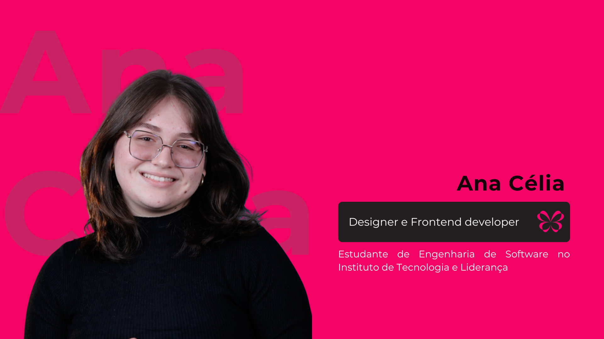
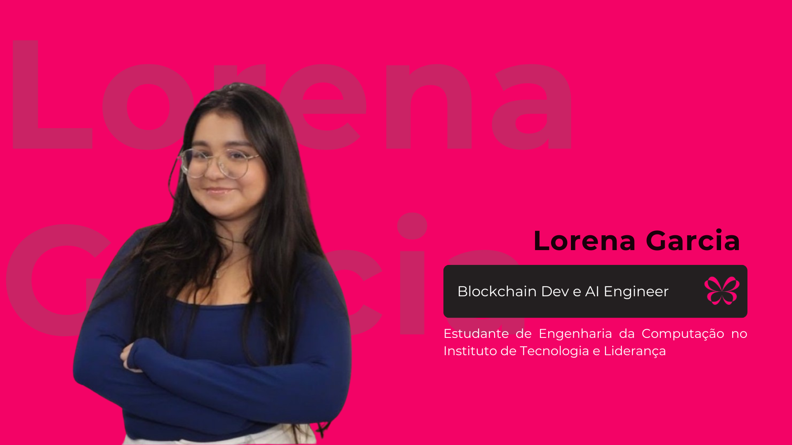

<div align="center">

# Stark

</div>

<p align="center">
  
</p>

<p align="center"><i>Aprender, trabalhar e receber com liberdade.</i></p>

---

<div align="center">
  
</div>

## Equipe

<div align="center">
  <table>
    <tr>
      <td align="center">
        <a href="https://www.linkedin.com/in/maria-arielly">
          <br>
          <sub><b>Maria Arielly</b></sub>
        </a><br>
        <sub>Business e UX/UI</sub>
      </td>
      <td align="center">
        <a href="https://www.linkedin.com/in/ana-c%C3%A9lia-amaral/">
          <br>
          <sub><b>Ana Célia</b></sub>
        </a><br>
        <sub>UX/UI e Frontend</sub>
      </td>
      <td align="center">
        <a href="https://www.linkedin.com/in/llorengarcia/?locale=pt">
          <br>
          <sub><b>Lorena Garcia</b></sub>
        </a><br>
        <sub>Blockchain e IA</sub>
      </td>
    </tr>
  </table>
</div>

## Descrição

A **Stark** é uma plataforma que conecta **microcapacitação, trabalho digital,
identidade portátil e pagamento rápido** para mulheres em vulnerabilidade
econômica.

Na mesma jornada, a participante aprende uma competência, aplica o conhecimento
em uma tarefa financiada, recebe avaliação humana e, após a aprovação, é paga
pela Lightning Network. Nostr oferece autenticação segura e reputação
verificável sem exigir que a chave privada seja compartilhada com a plataforma.

O nome homenageia
[Elizabeth Stark](https://lightning.engineering/team/), cofundadora e CEO da
Lightning Labs. O projeto é independente e não possui vínculo institucional ou
comercial com ela ou com a empresa.

<p align="center">
  <b><a href="https://anacelia1827.github.io/Hack4freedom/">Acessar a documentação completa</a></b>
</p>

## Problema enfrentado

Mulheres em vulnerabilidade podem enfrentar simultaneamente baixa renda,
informalidade, dependência financeira, sobrecarga de cuidado, violência,
dificuldade de reinserção profissional e acesso digital limitado.

No Brasil:

- a informalidade atingiu 39,0% da população ocupada em 2024;
- mulheres dedicavam 21,3 horas semanais a cuidados e afazeres, ante 11,7 horas
  dos homens;
- 32% das mulheres usuárias de Internet acessavam somente pelo celular;
- entre mulheres que relataram violência, 46% apontaram impacto no trabalho
  remunerado e 42% nos estudos.

A lacuna central está entre **aprender e receber**. Cursos isolados não garantem
oportunidades; tarefas sem recursos reservados não garantem pagamento; e possuir
uma conta não garante privacidade ou controle financeiro.

## Ecossistema Stark

| Conceito | Descrição | Finalidade |
|:---|:---|:---|
| **Identidade Nostr** | Login por evento assinado, sem transmissão da chave privada | Oferecer identidade portátil e segura |
| **Microcapacitação** | Trilhas curtas ligadas a habilidades específicas | Reduzir o tempo entre aprendizagem e aplicação |
| **Tarefa financiada** | Trabalho digital com escopo, valor e critérios definidos | Converter conhecimento em experiência e renda |
| **Revisão humana** | Aprovação ou solicitação justificada de correção | Evitar decisões opacas e preservar a qualidade |
| **Pagamento Lightning** | Liquidação em satoshis após a aprovação | Reduzir o tempo até o recebimento |
| **Badge verificável** | Evidência NIP-58 publicada mediante consentimento | Construir reputação portátil sem expor dados sensíveis |
| **Ledger segregado** | Registro separado de remuneração, impacto, capital e custos | Garantir rastreabilidade e prestação de contas |

## Principais funcionalidades

### 1. Identidade segura e portátil

- autenticação Nostr de ponta a ponta;
- proteção contra replay e desafios expirados;
- chave privada mantida no signer da participante;
- publicação de conquistas condicionada ao consentimento.

### 2. Capacitação conectada ao trabalho

- trilhas curtas e compatíveis com uma experiência mobile-first;
- avaliação objetiva e evidência de habilidade;
- desbloqueio de oportunidades relacionadas ao conteúdo praticado.

### 3. Marketplace de tarefas financiadas

- apresentação prévia de escopo, prazo, remuneração e critérios;
- recursos reservados antes da publicação;
- reserva exclusiva de uma vaga;
- entrega, revisão humana e possibilidade de correção.

### 4. Pagamento Lightning real

- geração de obrigação após aprovação;
- validação de invoice BOLT11;
- idempotência e controle contra pagamento duplicado;
- reconciliação, ledger e recibo auditável.

### 5. Transparência de impacto

- separação entre valor-base, matching e bônus;
- distinção entre fundo de impacto e capital de liquidez;
- indicadores baseados em tarefas e valores efetivamente realizados;
- identificação explícita de dados `MOCK`, `SANDBOX` e `REAL`.

## Tecnologias

| Camada | Tecnologia | Uso |
|:---|:---|:---|
| **Frontend** | React, TypeScript e Vite | SPA responsiva e mobile-first |
| **Backend** | Python e Flask | API e regras de negócio |
| **Dados** | PostgreSQL, SQLAlchemy e Alembic | Persistência, ledger, idempotência e outbox |
| **Identidade** | Nostr e NIP-07 | Login por assinatura |
| **Reputação** | Nostr e NIP-58 | Badges verificáveis e consentidos |
| **Pagamentos** | Bitcoin e Lightning Network | Pagamentos em satoshis |
| **Documentação** | Docusaurus | Documentação técnica, de produto e negócio |
| **Conversão opcional** | Hodle/Pix | Saída para reais, ainda planejada |

## Arquitetura resumida

```text
Participante
   │
   ▼
SPA React/Vite
   │ HTTP + sessão
   ▼
API Flask
   ├── identidade Nostr
   ├── capacitação e reputação
   ├── tarefas e revisão
   └── obrigações, ledger e pagamentos
             │
             ├── PostgreSQL
             └── Lightning Network
```

O backend segue um modelo de **monólito modular**. Serviços independentes devem
ser extraídos somente quando escala, segurança ou operação justificarem a
complexidade adicional.

## Modelo de sustentabilidade

O trabalho deve ser financiado principalmente por quem utiliza a entrega.
Doações ampliam o impacto, mas não substituem indefinidamente a demanda
comercial.

O pagamento pode combinar:

1. valor-base da empresa;
2. matching previamente reservado pelo fundo de impacto;
3. bônus opcional proveniente apenas de resultado Lightning positivo,
   conciliado e realizado.

Capital de liquidez não é receita, não paga tarefas diretamente e não possui
retorno garantido.

## Status

**MVP integrado — autenticação Nostr segura e pagamento Lightning real
implementados; preparação para piloto controlado.**

Prioridades atuais:

- persistência durável de toda a jornada;
- autorização completa por papel e propriedade;
- armazenamento privado das entregas;
- limites e observabilidade de tesouraria;
- testes ponta a ponta e revisão de segurança;
- validação com participantes, organizações e empresas.

Consulte o
[status detalhado](https://anacelia1827.github.io/Hack4freedom/status) e o
[roadmap](https://anacelia1827.github.io/Hack4freedom/roteiro).

## Executar a documentação

Requisito: Node.js 20 ou superior.

```bash
cd docs
npm install
npm run start
```

A documentação ficará disponível em
`http://localhost:3000/Hack4freedom/`.

Build de produção:

```bash
cd docs
npm run build
npm run serve
```

## Links

- [Documentação](https://anacelia1827.github.io/Hack4freedom/)
- [Repositório](https://github.com/AnaCelia1827/Hack4freedom)
- [Equipe](https://anacelia1827.github.io/Hack4freedom/equipe)
- [Arquitetura técnica](https://anacelia1827.github.io/Hack4freedom/implementa%C3%A7%C3%A3o/arquitetura_tecnica)

---

<p align="center">
  Desenvolvido para o <b>Hack4Freedom Brasil 2026</b>, em São Paulo.
</p>
